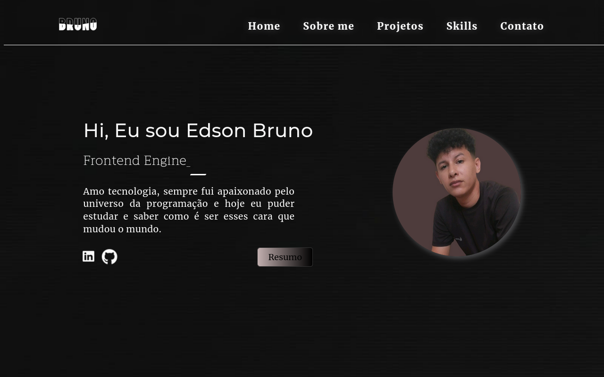

# Portfolio

"Portfolio-Web: HTML, CSS, JS. Em breve, Angular. Explore minha jornada no desenvolvimento web. 💻✨"
Nome do Projeto: Portfolio-Web

Descrição: Este é o repositório do meu portfólio pessoal, onde eu demonstro minhas habilidades em desenvolvimento web utilizando HTML, CSS e JavaScript. Atualmente, o site está em constante evolução, e em breve será atualizado para utilizar o framework Angular, proporcionando uma experiência mais dinâmica e interativa.

Recursos Destacados:

    HTML, CSS, JavaScript: Fundamentos sólidos de desenvolvimento web para
    criar uma interface intuitiva e atraente.
    Em constante evolução: Estou sempre trabalhando para melhorar e adicionar
    novos projetos ao meu portfólio.smile: 💻 🧑‍💻 
    
    Fique atento para as últimas atualizações!
    Futuro Angular: 
    Estou empolgado em anunciar que em breve vou migrar para o framework
    Angular para aprimorar
    a funcionalidade e a escalabilidade do meu site.

Sinta-se à vontade para explorar meu código-fonte e fornecer feedback. Seja bem-vindo ao meu espaço digital, onde compartilho minha jornada no desenvolvimento web e mostro meu amor pela criação de experiências online incríveis.
